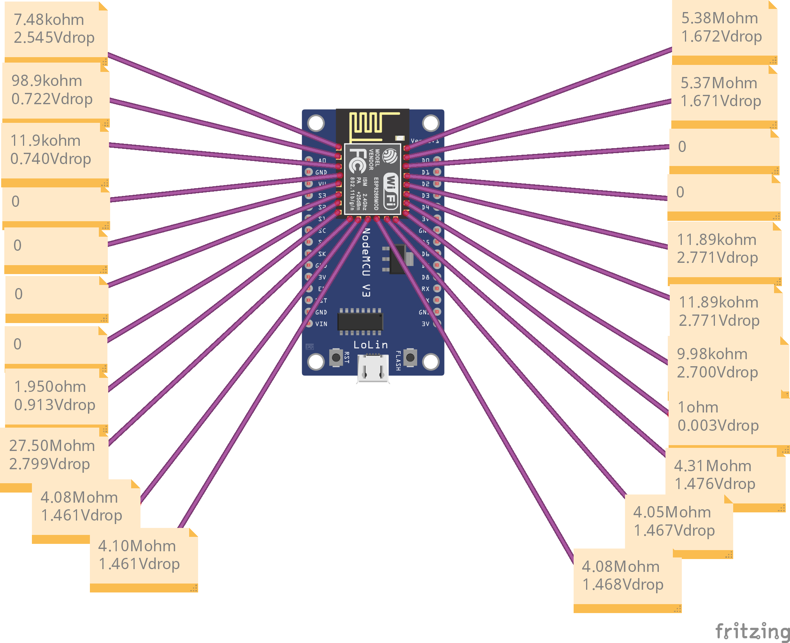

# If you have problems with your ESP8266 0.1 NodeMCU v3 check these Resistance and Vdrop values. By comparing these values with your ESP, you will figure out quickly if GPIO and/or Digital pins are dead.

 > **You have the code but it doesn't work no matter what you do.**

 > **Compare these values with your ESP, this will save you a lot of time.**
 

